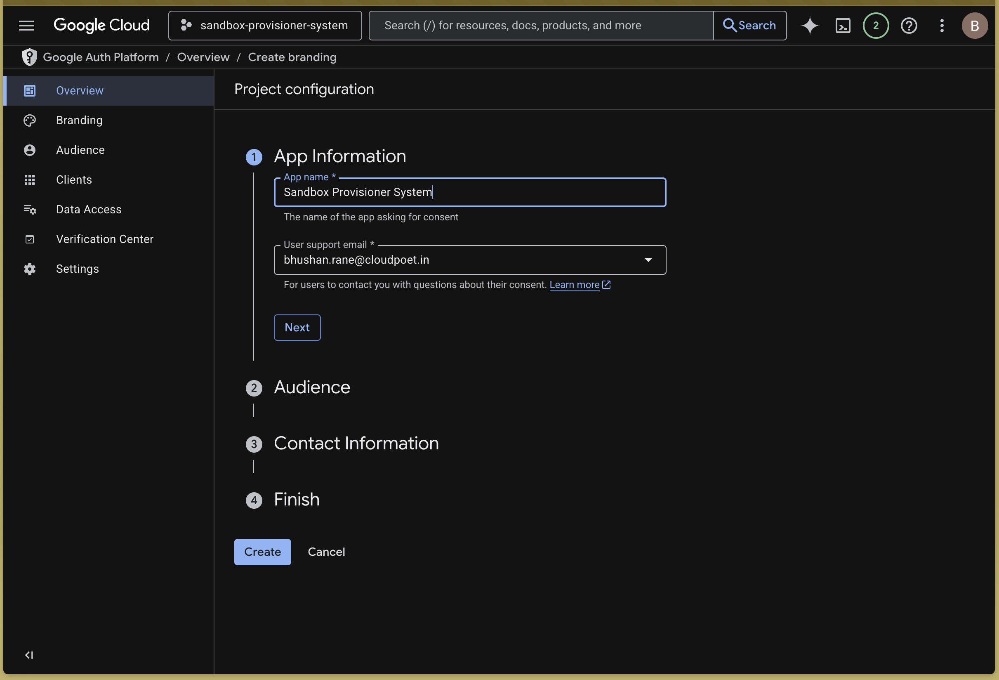
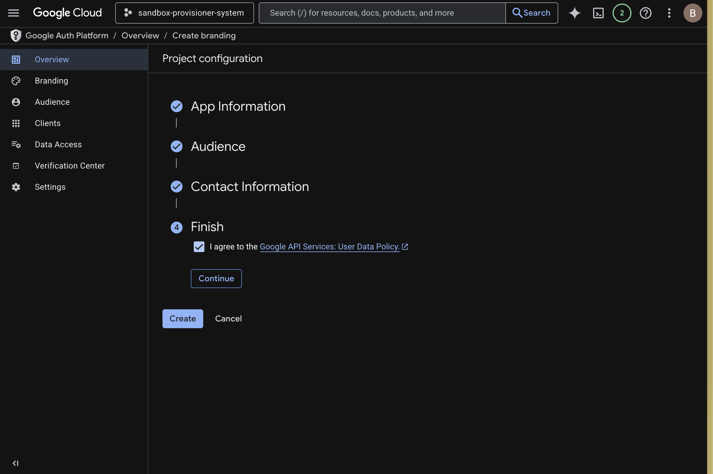
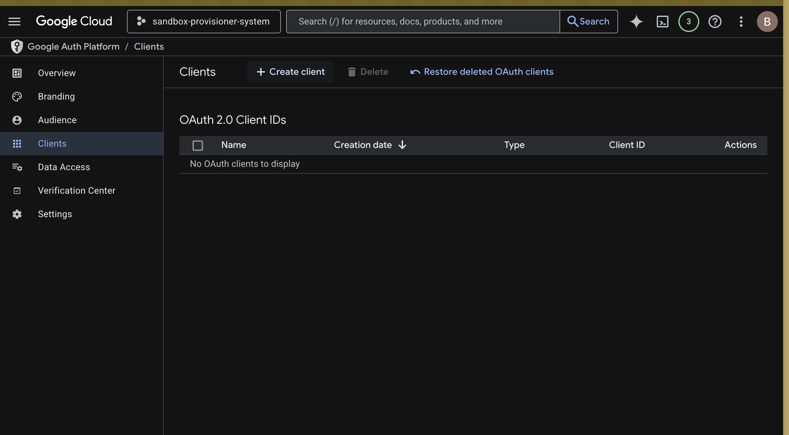
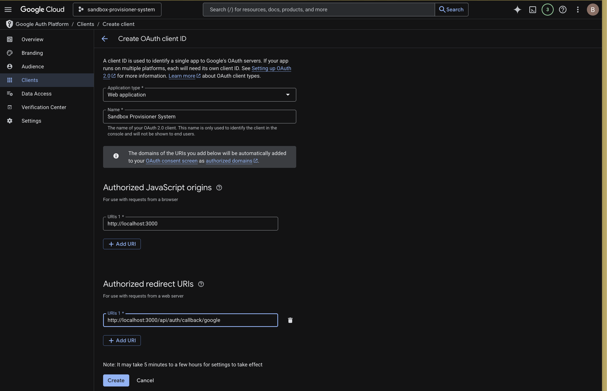

# OAuth Setup Guide

This guide walks you through setting up Google OAuth credentials for the GCP Sandbox Provisioner application.

## Prerequisites

- Bootstrap phase of Terraform has been completed
- You have access to the GCP Console
- Project ID: `sandbox-provisioner-system` (or your custom project ID from Terraform output)

---

## Step 1: Configure OAuth Consent Screen

### 1.1 Navigate to OAuth Consent Screen

**URL:** https://console.cloud.google.com/auth/overview?project=sandbox-provisioner-system&supportedpurview=project

> **Note:** Replace `sandbox-provisioner-system` with your actual project ID from Terraform output.



### 1.2 Select User Type

- Choose **Internal** if you're using Google Workspace (recommended)
- Choose **External** if you're using personal Gmail accounts

### 1.3 Fill in App Information

**Required Fields:**
- **App name:** `GCP Sandbox Provisioner`
- **User support email:** Your email address
- **Developer contact information:** Your email address

**Optional Fields:**
- **App logo:** Upload a logo if you have one
- **Authorized domains:** Add your custom domain if using one

### 1.4 Scopes

Click **"SAVE AND CONTINUE"** through the scopes section. The default scopes are sufficient.

### 1.5 Summary

Review your settings and click **"BACK TO DASHBOARD"**.

---

## Step 2: Create OAuth Client Credentials

### 2.1 Navigate to OAuth Clients

**URL:** https://console.cloud.google.com/auth/clients?project=sandbox-provisioner-system&supportedpurview=project

> **Note:** Replace `sandbox-provisioner-system` with your actual project ID.


### 2.2 Create OAuth Client ID

Click **"CREATE CREDENTIALS"** → **"OAuth client ID"**



### 2.3 Configure Web Application

**Application type:** Web application

**Name:** `Sandbox Provisioner Web Client`

**Authorized JavaScript origins:** (Optional)
```
http://localhost:3000
https://YOUR_DOMAIN
```

**Authorized redirect URIs:** (Required)
```
http://localhost:3000/api/auth/callback/google
https://YOUR_DOMAIN/api/auth/callback/google
```



> **Important:** Replace `YOUR_DOMAIN` with your actual domain name if deploying to production.

### 2.4 Save Credentials

Click **"CREATE"**



### 2.5 Copy Credentials

**IMPORTANT:** Copy and save these credentials securely:
- **Client ID:** `XXXXXXXXXX.apps.googleusercontent.com`
- **Client Secret:** `GOCSPX-XXXXXXXXXXXXXXXXXXXX`

You'll need these for the next Terraform phase.

---

## Step 3: Get Google AI API Key

1. Visit: https://makersuite.google.com/app/apikey
2. Create a new API key or use an existing one
3. Copy the API key (you'll store it in Secret Manager next)

---

## Step 4: Update Application Secret in Google Secret Manager

**IMPORTANT:** Never store secrets in `terraform.tfvars` or commit them to git!

Terraform has already created a JSON secret named `sandbox-provisioner-system-secret` during bootstrap. Now you need to update it with your actual credentials.

### 4.1 Update the JSON Secret

```bash
cat <<EOF | gcloud secrets versions add sandbox-provisioner-system-secret \
  --project=sandbox-provisioner-system \
  --data-file=-
{
  "GOOGLE_CLIENT_ID": "YOUR_CLIENT_ID.apps.googleusercontent.com",
  "GOOGLE_CLIENT_SECRET": "GOCSPX-YOUR_CLIENT_SECRET",
  "AUTH_SECRET": "$(terraform output -raw auth_secret)",
  "GOOGLE_API_KEY": "YOUR_GOOGLE_AI_API_KEY",
  "NEXTAUTH_URL": "http://localhost:3000"
}
EOF
```

> **Note:**
> - Replace `sandbox-provisioner-system` with your actual project ID
> - Replace `YOUR_CLIENT_ID`, `YOUR_CLIENT_SECRET`, and `YOUR_GOOGLE_AI_API_KEY` with your actual values
> - `AUTH_SECRET` is automatically retrieved from Terraform output (pre-generated during bootstrap)

### 4.2 Alternative: Use the Interactive Script

For easier secret management, use the provided interactive script:

```bash
cd docs
./SECRET_MANAGER_SETUP.sh
```

This script will:
- Prompt you for each credential securely
- Automatically retrieve AUTH_SECRET from Terraform
- Update the JSON secret with all values at once
- Verify the secret was updated successfully

### 4.3 Verify Secret Was Updated

```bash
gcloud secrets describe sandbox-provisioner-system-secret --project=sandbox-provisioner-system
gcloud secrets versions list sandbox-provisioner-system-secret --project=sandbox-provisioner-system
```

You should see the secret with the latest version number.

---

## Step 5: Update Terraform Configuration

### 5.1 Create `terraform.tfvars` (Non-Secret Values Only)

In your Terraform directory, create a file named `terraform.tfvars`:

```hcl
# Enable Cloud Run deployment
deploy_cloud_run = true

# Optional: Custom domain configuration
# custom_domain = "sandbox.example.com"
```

> **Security Note:** Secrets are stored in Google Secret Manager and will be automatically injected into Cloud Run at runtime. Never add secrets to this file!

---

## Step 5: Deploy to Cloud Run

### 5.1 Run Terraform Apply

```bash
terraform apply --auto-approve
```

**What happens during deployment:**
1. ✅ Cloud Build automatically builds your container from source
2. ✅ Container is pushed to Google Container Registry
3. ✅ Cloud Run service is deployed with secrets from Secret Manager
4. ✅ Service URL is output for immediate access

---

## Troubleshooting

### Error: Redirect URI Mismatch

**Problem:** You get a redirect URI mismatch error when trying to sign in.

**Solution:**
1. Check that your authorized redirect URIs exactly match your application URL
2. For local development: `http://localhost:3000/api/auth/callback/google`
3. For production: `https://YOUR_DOMAIN/api/auth/callback/google`
4. There should be NO trailing slash

### Error: Invalid Client

**Problem:** OAuth error saying "Invalid client"

**Solution:**
1. Verify your Client ID and Client Secret are correct in `terraform.tfvars`
2. Make sure there are no extra spaces or quotes
3. Redeploy with `terraform apply --auto-approve`

### Error: Access Denied

**Problem:** "Access denied" or "User not authorized"

**Solution:**
1. If using Internal user type: Make sure the user is part of your Google Workspace organization
2. If using External user type: Add test users in the OAuth consent screen configuration

---

## Security Best Practices

### ✅ DO:
1. **Use Google Secret Manager** for all secrets (OAuth credentials, API keys)
2. **Add `.tfvars` to .gitignore** to prevent accidental commits
3. **Rotate credentials regularly** (at least every 90 days)
4. **Use Internal OAuth type** for Google Workspace organizations
5. **Grant minimal IAM permissions** to service accounts
6. **Enable audit logging** for Secret Manager access

### ❌ DON'T:
1. **Never store secrets** in `terraform.tfvars` or any configuration files
2. **Never commit secrets** to version control (git)
3. **Never share secrets** via email, chat, or unencrypted channels
4. **Never hardcode secrets** in application code
5. **Never use the same secrets** across environments (dev/staging/prod)

### Secret Manager Benefits:
- ✅ **Encryption at rest** and in transit
- ✅ **Automatic versioning** of secrets
- ✅ **IAM-based access control**
- ✅ **Audit logging** of all access
- ✅ **Automatic rotation** support
- ✅ **No risk of git commits** with secrets

---

## Next Steps

After completing OAuth setup and deploying to Cloud Run:

1. Access your application at the Cloud Run service URL (from Terraform output)
2. Test the Google sign-in flow
3. Configure your first admin user in the application
4. Start provisioning sandboxes!

---

## Additional Resources

- [Google OAuth 2.0 Documentation](https://developers.google.com/identity/protocols/oauth2)
- [NextAuth.js Google Provider](https://next-auth.js.org/providers/google)
- [Cloud Run Documentation](https://cloud.google.com/run/docs)
